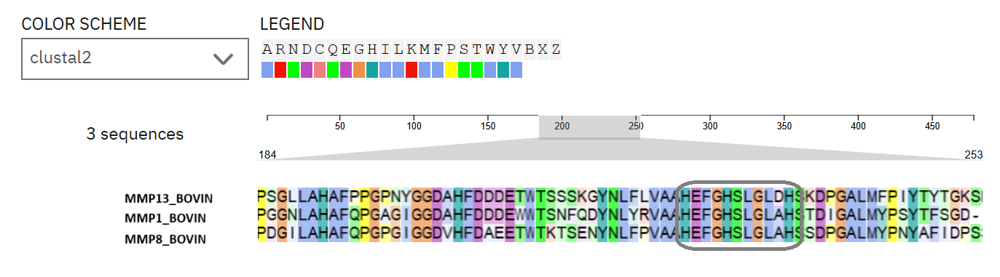

# Multiple Sequence Alignment of Bovine MMP Genes

## Project Overview
Multiple sequence alignment of three bovine matrix metalloproteinases (MMP1, MMP8, MMP13) using Clustal Omega to identify the conserved Zn²⁺ binding site.

## Sequences Analyzed
- **MMP13_BOVIN** (O77656) - Collagenase 3
- **MMP1_BOVIN** (P28053) - Interstitial collagenase  
- **MMP8_BOVIN** (XP_024831456.2) - Neutrophil collagenase

## Key Findings
- **Successfully performed multiple sequence alignment** using Clustal Omega
- **Identified conserved Zn²⁺ binding site**: HEXXHXXGXXH motif
- **Histidine residues** at positions ~200-210 coordinate zinc ion
- **High conservation** in catalytic domain across all bovine MMPs

## Files Included
- `MMPS.fasta` - Input sequences in FASTA format
- `alignment_screenshot.png` - Results visualization from Clustal Omega

## Results
The multiple sequence alignment revealed the characteristic zinc binding site motif `HEXXHXXGXXH` in all three MMP sequences, confirming the conserved catalytic domain structure.

*Multiple sequence alignment showing conserved regions and zinc binding site*

## Methodology
1. **Sequence retrieval**: MMP sequences obtained from UniProt/NCBI
2. **Alignment tool**: Clustal Omega for multiple sequence alignment  
3. **Analysis**: Visual identification of conserved motifs and domains
4. **Validation**: Confirmation of characteristic Zn²⁺ binding site
